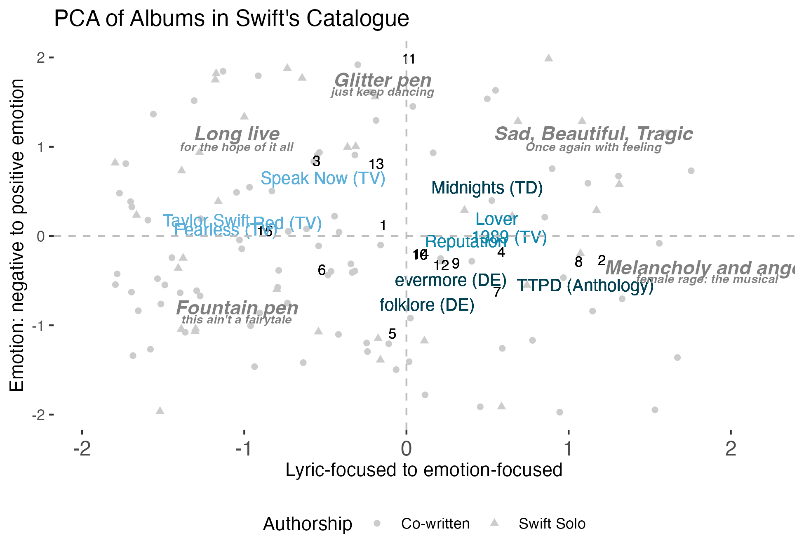

I'm an institutionalist at heart and most of the substance of my work explores how we create rules and meaning for ourselves. Methodologically, I am a computational social scientist interested in contributing to methodological approaches, such as text analysis and agent-based modeling. 

# Ongoing projects
I have four main projects in process right now -- all generally computational in nature, mostly focused upon how we make meaning. The third project, on ABMs, is a methodological project exploring how to maximize outcomes. 

## Political Candidate Playlists

In this project, I analyze songs used by US political candidates in their campaigns in the 2016, 2020, and 2024 presidential elections. The project is underway, but in preliminary findings I observe that political candidates favor music incorporating themes of trust and increasingly use songs with prosocial messages. Republican candidates have less emotional music that has incorporated more male references over time. Democratic candidates have music that feature more moral references and has had a more negative tone over subsequent election cycles. 

## Music lyrics

This is a multifaceted project looking at new methodological approaches to text analysis. In the initial project, we explore one artist's cannon and analyze distinctions between rhetoric-focused and emotion-focused language, mapping a landscape across the career of Taylor Swift. This article is forthcoming at *Psychology of Creativity, Aesthetics, and the Arts.*


```{r, echo = F, out.width="80%", out.height="70%",fig.cap="PCA of Taylor Swift's Catalogue",fig.show='hold',fig.align='center',fig.alt = "Average data points for albums in Taylor Swift's catalogue from lyric to emotion-focused and negative to positive emotion"}


```

In it, we track the development of Swift as an artist, finding that her work incorporates a juxtaposition of contrasting emotions in what we term 'Swiftian Saudade.' Her work evolves from a more positive and lyrically focused space to one full of darker emotions. 

Our follow-up project expands beyond one artist to look more generally at pop music. 

## Place-making
This project explores how fandom creates self-reinforcing structures. I scrape fandom subreddits, analyzing the content of discussions and how fans create expansive third places. 


## ABM
This project is a collaboration on ABM design from a perspective of better means to evaluate the model's success. We use machine learning to predict effective parameter combinations for more productive sweeps. 

# Publications
* Clipperton, Jean, and Loizos Bitsikokos. 2025. “You Do Not Get to Tell Me about Sad: Swiftian Saudade in Taylor Swift’s Lyrics.” Psychology of Aesthetics, Creativity, and the Arts. doi:10.1037/aca0000810. [preprint/online first pdf available here](papers/PACA_clipperton_swiftian_saudade.pdf)
* Alter, K., Clipperton, J., Schraudenbach, E., & Rozier, L. (2020). Gender and Status in American Political Science: Who Determines Whether a Scholar Is Noteworthy? Perspectives on Politics, 18(4), 1048-1067. doi:10.1017/S1537592719004985
 
# Talks
*  Clipperton, Jean. 2025. ["It's a new soundtrack: political candidates, campaigns, and playlists"](talks/clipperton_workshop_25.html) MACSS Computational Social Science Workshop, University of Chicago, Fall 2025
* Simpson College, Fall 2025

## Non Peer-Reviewed Publications
*	Clipperton, et al. Empirical Methods in Political Science: An Introduction Summer 2019
	https://nulib-oer.github.io/empirical-methods-polisci/ 
*	Alternative Final Assignment Format Tips and Tools, guest blog post with NU Digital Learning Fall 2020
	https://canvaspost.northwestern.edu/2020/12/07/alternative-final-assignment-format-tips-and-tools/ 
* 	Increasing Zoom Engagement, guest blog post with NU Digital Learning Fall 2020
	https://canvaspost.northwestern.edu/2020/10/19/tips-for-zoom-engagement-in-the-virtual-classroom/ 
*	Alternative Final Assignment Formats, guest blog post with NU Digital Learning Spring 2019 
https://digitallearning.northwestern.edu/article/2019/04/23/alternative-final-assignment-formats
* 	Incorporating Student feedback, guest blog post with NU Digital Learning Winter 2019
		https://digitallearning.northwestern.edu/article/2019/01/31/incorporating-student-feedback-your-course 
* 	Improving your Course, guest blog post with NU Digital Learning Fall 2018 
		https://digitallearning.northwestern.edu/article/2018/09/10/easy-things-you-can-do-improve-your-course-and-your-teaching 


# Working Papers
* Clipperton, Jean. 2025. "It's a new soundtrack: political candidates, campaigns, and playlists"
* Clipperton, Jean, Josue Franco, Shane Nordyke, Melissa Shaffer O’Connell, Frederick Wood. 2020. “SOTL Research Design for Assessment of Interventions.” APSA Preprints. doi:10.33774/apsa-2020-gwfl0.


